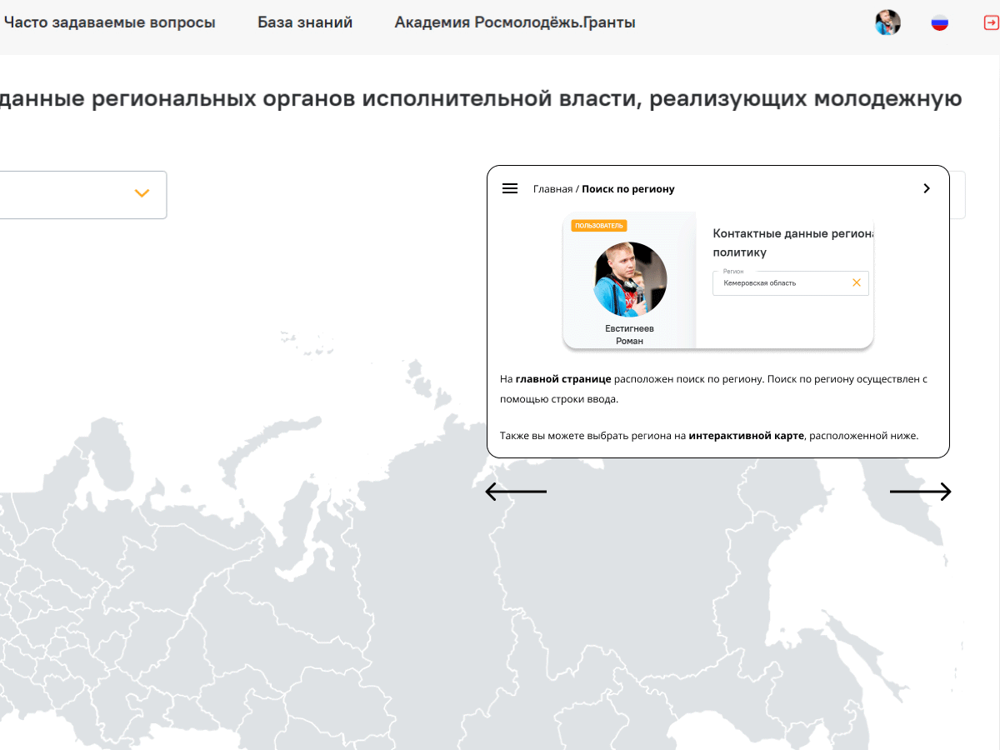
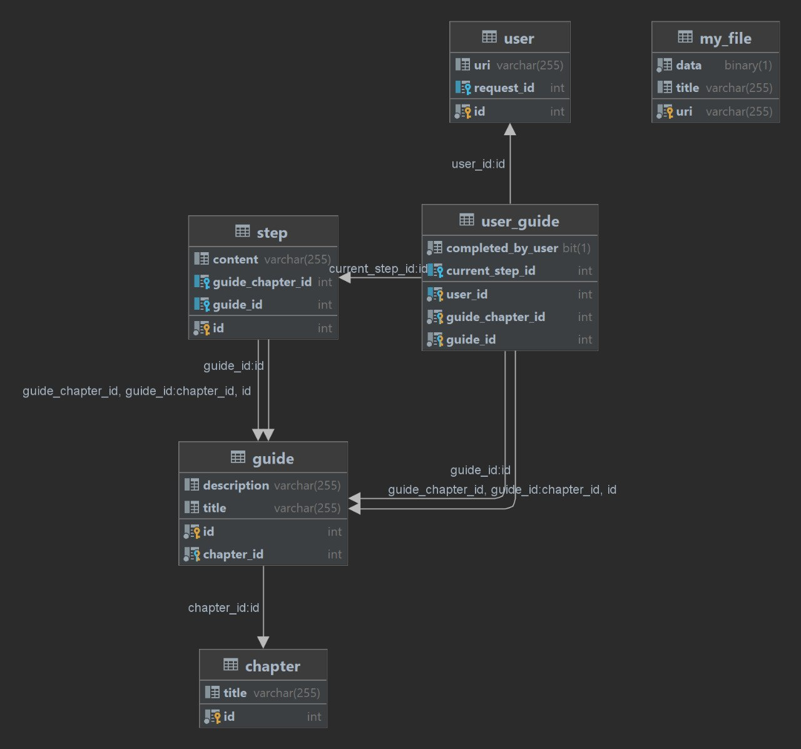
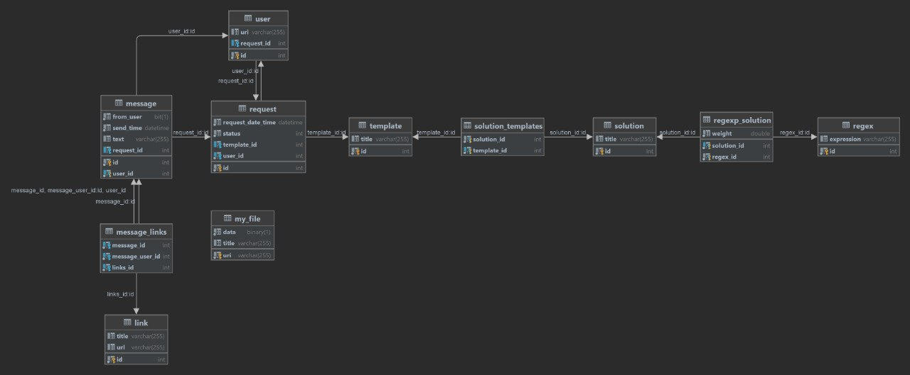

<h1 align="center">Интерактивный виджет пошагового инструктирования</h1>

----

----

----
## Stack
Java, Spring Boot, Maven, JDBC, Hibernate, SQL, Lombok.
____
## Краткое описание
Проект представляет собой backend прототипа приложения "Цифровой Помощник",
основной задачей которого является помощь при заполнении заявки на получение
гранта на сайте https://myrosmol.ru
____
## Интерфейс

____
### Навигатор
Данный модуль отвечает за навигацию пользователя по сайту.

Структура БД
 

 

____
### Ассистент
Данный модуль предоставляет пользователю ответ на поставленный вопрос. 

Структура БД
 

