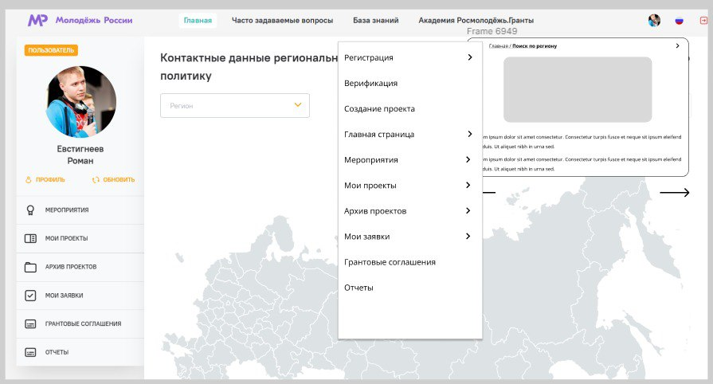

<h1 align="center">Interactive step-by-step instruction widget</h1>

----

----

----
## Stack
Java, Spring Boot, Maven, JDBC, Hibernate, SQL, Lombok.
____
## Short description
This Spring Boot app is "Digital Helper",
it supports completing the application on https://myrosmol.ru, which is the main task it solves
____
## UI

____
### Navigator
This module helps to navigate on site.

DB Structure
 

 

____
### Assistant
This is a FAQ module. 

DB Structure
 

